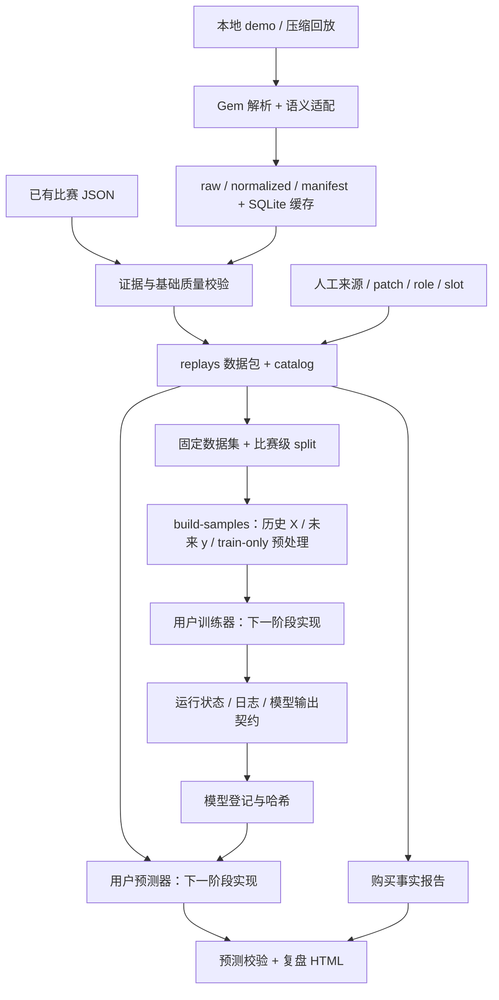

# 工程设计：v0.3

> v0.4 数据准备更新：`prepare` 已实现单文件清洗/特征/标签；`build-samples` 输出固定 split 的训练数组和 train-only 预处理。输入、错误策略、任务 mask 和操作示例以[数据管线](data-pipeline.md)为准。实际模型与真实字段验收仍待完成。

基线日期：2026-10-02。功能状态见[完成度](project-status.md)，选型理由见[技术选型](long-term-roadmap.md)。本文描述现有结构；文末单列规划。

## 系统边界

这是一个可在本地或普通 Python 云端环境运行的文件工作流。用户提供回放和来源标签，框架管理数据快照、运行记录与报告。没有常驻 HTTP 服务、账户系统或训练集群。

## 模块职责

| 模块 | 职责 |
|---|---|
| [coach.py](../coach.py)、[bootstrap.py](../scripts/bootstrap.py) | 启动项目 venv、安装可选依赖；不管理 GPU |
| [workflow/cli.py](../src/dota_items/workflow/cli.py) | 新命令、批次结果、Schema 和适配器模板初始化 |
| [sources/gem_replay.py](../src/dota_items/sources/gem_replay.py) | 解压、解析、购买规范化、旧 SQLite 缓存 |
| [sources/gem_observations.py](../src/dota_items/sources/gem_observations.py) | 用 game_clock 导出位置与自身经济通道 |
| [sources/opendota.py](../src/dota_items/sources/opendota.py) | OpenDota HTTP 请求、有限重试、原始响应缓存 |
| [normalize.py](../src/dota_items/normalize.py)、[domain.py](../src/dota_items/domain.py) | 购买时间线、缺失/非法事件状态和事实结构 |
| [analysis.py](../src/dota_items/analysis.py)、[report.py](../src/dota_items/report.py) | 关注装备的最早购买记录、转义的静态 HTML |
| [storage.py](../src/dota_items/storage.py) | 跨数据源与工作流共用的文件指纹、JSON 原子替换、相对路径检查和写锁 |
| [workflow/validation.py](../src/dota_items/workflow/validation.py) | 比赛结构、原始证据引用和时序基础检查 |
| [workflow/workspace.py](../src/dota_items/workflow/workspace.py) | 数据包、catalog、标签、status、doctor |
| [workflow/datasets.py](../src/dota_items/workflow/datasets.py) | 筛选、按比赛划分、复制快照、数据集 ID |
| [data/](../src/dota_items/data/) | 输入清洗、backward 对齐、未来标签、固定样本、sklearn 预处理 |
| [workflow/contracts.py](../src/dota_items/workflow/contracts.py) | 配置、标签、模型和预测的 Pydantic 契约 |
| [workflow/jobs.py](../src/dota_items/workflow/jobs.py) | 子进程运行、日志、状态、模型登记与读取 |
| [workflow/reviews.py](../src/dota_items/workflow/reviews.py) | 模型适用范围、预测引用校验、复盘输出 |

## 存储层分工

| 数据 | 当前存储 | 身份/更新规则 |
|---|---|---|
| 原始 demo | 用户目录或 inbox | 用户负责保存；框架不自动复制到数据包 |
| 解析中间产物 | cache 中 JSON + SQLite | 输入文件字节哈希为键，可强制重建 |
| 已接受比赛 | replays 中 JSON 数据包 | match_id 唯一；相同指纹复用，冲突拒绝 |
| 当前人工标签 | catalog.json | 每场一组；重标覆盖，无标签历史表 |
| 数据集 | datasets 中复制快照 + JSONL | 配置、标签、划分、文件哈希共同决定 ID |
| 训练任务 | runs 中状态/日志/输出 | 每次独立 UUID；无后台调度器 |
| 登记模型 | models 中复制产物 | run、dataset、描述和文件指纹决定 ID |
| 复盘 | reviews 中状态/JSON/HTML | 每次独立目录；不登记为不可变数据集 |

**SQLite 目前只属于旧解析缓存。** 新工作区的 catalog 是 JSON，不能按“全项目已迁移数据库”理解。旧缓存包含绝对路径；新快照内部使用相对路径，但历史运行命令与报告元数据仍可能保存绝对路径。

## 导入与一致性

1. 解压流按实际格式处理；zip 只接受一个 demo，读取成员内容而不按成员路径落盘。
2. 解析并保留原始 JSON；适配器导出 `gem-adapter/2.2`。
3. 校验输入，在同文件系统的 `.staging` 复制证据、规范数据和质量记录，再校验一次。
4. 计算数据包文件哈希，重命名发布目录，原子替换 catalog。
5. 发布后、catalog 更新前若中断，相同输入再次导入可识别已发布数据包并补上索引。

导入、标注和构建数据集使用同一个排他文件锁。锁冲突直接报错；没有等待队列或陈旧锁自动恢复。Gem 中间缓存的解析和写入发生在新工作区导入锁之外，不具备上述发布协议。

单文件写入使用临时文件、fsync、os.replace。它减少半写 JSON 的风险，但未提供目录 fsync、跨文件数据库事务、完整断电保证或多机并发协议。文件哈希用于发现变化，不是签名或不可篡改存储。

## 数据集与时间边界

默认选择人工标注为 pro/high_mmr、patch 精确匹配、role 匹配的玩家；可限定英雄。空间数据集只检查位置和可用经济采样非空，尚无覆盖率或完整性门槛。

按 `hash(seed, match_id)` 排序后分配 split，同场所有玩家归到一组。最少 3 场保证三组非空；小样本比例会取整。新增比赛会改变新数据集的划分，因此比较实验应固定 dataset_id。当前没有时间外推留出集或跨版本评估机制。

数据包完整复制到数据集，包含其他玩家及整场原始字段；JSONL 中的 `player_slots` 声明应使用哪些参考玩家。`build-samples` 遵守这个列表并生成截止时间窗口；单文件 `prepare` 独立输出样本供审计。框架目前只校验预测解释所引用的记录没有晚于决策时间，无法保证模型内部没有使用未来数据。

## 模型执行边界

训练器/预测器使用当前 Python 解释器，以参数列表启动，不经过 shell；工作目录是适配器所在目录。它们与主程序共用依赖环境和文件访问权限。

运行记录保存配置、主脚本副本/哈希、部分包版本、命令、stdout/stderr、时间和状态。实际执行的是原脚本，其他模块、数据预处理代码和完整环境尚未一并冻结。

直接子进程有超时；用户自行创建的分布式进程树、设备资源和检查点恢复仍由适配器负责。任务成功仅代表进程与输出契约通过；模型登记没有性能门槛。

## 报告与能力边界

旧分析器输出购买事实，不将“购买晚”直接称为错误。模型报告可展示 item/route 候选和分数，校验身份、范围、任务及时间引用；文字中的“实际行动”和解释由预测器提供，未与游戏事件逐项验证。

HTML 文本转义、无需 CDN。当前没有地图、路线轨迹、库存状态、敌方可见性或因果决策价值模型。事实报告模板的标题仍保留 v0.1 字样，已列为 UI 待修项，不能据此判断包版本。

## 下一阶段的结构变化

优先补齐原回放/解析环境追踪、真实字段验证、完整性与覆盖率、解析资源限制和故障恢复。窗口/标签层应在快照与训练器之间显式建立。Parquet、统一 SQLite catalog、任务队列和 Web 界面均需满足[选型路线](long-term-roadmap.md)中的实际触发条件后再引入。
