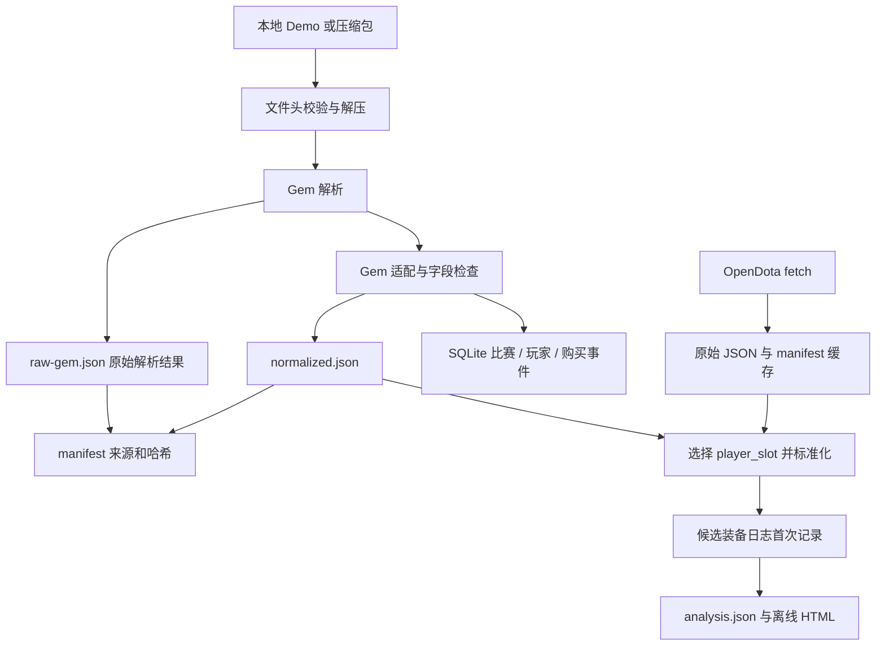

# DOTA2 出装与装备时机分析：工程设计

更新：2026-09-29。实现基线：v0.2.0 / `720b405`。本文区分已实现与目标设计；
更新文档不代表下述待办已经进入代码。任务状态以 [roadmap](roadmap.md) 为准。

本次仅更新设计文档。长期演进见 [技术路线](long-term-roadmap.md)，未来字段与状态以
[数据契约](data-contracts.md) 为准，验收要求见 [验证与交付规范](validation-and-delivery.md)。
所有文档入口见 [文档导航](README.md)。

## 1. 项目要回答什么

从自己的一场 DOTA2 比赛出发，依次回答：

1. **事实重建**：购买日志记录了什么，候选装备何时首次出现？当前已实现。
2. **条件比较**：在同英雄、已确认位置、补丁和模式的样本中，这个时间处于什么范围？待实现。
3. **案例检索**：在某个历史时刻，哪些过去比赛的已知状态相似，它们随后怎样出装？待实现。
4. **行为预测实验**：简单模型能否比频率或规则基线更好地预测后续购买记录？可选。

首个可用于复盘的比较版本只做一个英雄、一个位置、一个补丁、一个普通比赛模式、3～5 件目标装备。
具体选择尚未确定；`configs/analysis.json` 的装备仅是示例。
先允许人工确认位置和版本，保留来源；未知值不靠猜测补齐。

这是一项观察性分析：买得晚可能与经济、局势、路线和玩家选择有关。不能据此判定决策错误，
也不能把热门出装或胜率相关性称为最优策略。暂不做实时辅助、强化学习、全英雄覆盖或多人在线服务。

## 2. 已实现的全流程



| 环节 | 当前行为 | 实际边界 |
|---|---|---|
| 输入 | `.dem`、`.dem.bz2`、`.dem.zst`、含一个 Demo 的 `.dem.zip`；支持目录批处理 | CLI 不下载 Demo；`fetch` 获取 OpenDota JSON |
| 解包 | BZip2 / Zstandard 按魔数识别；ZIP 流式读出一个 Demo；校验 `PBDEMS2` 文件头 | 文件头正确不等于回放完整；解压输出限制 2 GiB，原生 `.dem` 尚无相同限制 |
| 解析 | 可选依赖 Gem；输出完整解析 JSON | “原始 JSON”是解析器产物，不能替代原始 `.dem` |
| 适配 | 槽位、英雄、购买 key、游戏秒数、原始引用；记录部分异常 | patch 固定未知；没有位置和经济样本；部分异常跳过事件或玩家 |
| 保存 | 三份 JSON 与三张 SQLite 表；相同源文件默认命中缓存 | 各 JSON 替换和 SQL 事务分开，尚无整体提交或恢复协议 |
| 报告 | 单玩家购买表、候选装备首次记录、质量提示、来源指纹 | 不查询 SQLite；不比较其他比赛；不重建持有库存 |
| 测试 | 25 个现有测试、Ruff、Ubuntu Python 3.11 / 3.12 CI | Gem 主要由测试替身代替；完整真实 Demo 不是 CI fixture |

两条数据源当前只在 `normalize.py` / `PlayerTimeline` 汇合。
OpenDota 的 `fetch` 不写入 Demo 的 SQLite 索引，也没有跨来源去重和冲突处理。
`data-status` 的 `matches` 是导入记录数，不能直接用作未来统计的独立比赛数。

本地已验证公开比赛 `8822520406`：10 名玩家、362 条购买事件；362 条引用均可定位到
Gem JSON 的对应事件。它证明单个样本的流程与映射可用，不证明其他版本可解析、日志无漏检，
也不证明记录时刻就是合成完成或送达时间。详见 [工程审查](project-review.md)。

## 3. 当前数据契约

### 3.1 三个层次不要混用

| 层次 | 当前内容与版本 | 消费方 |
|---|---|---|
| Gem 原始解析 JSON | `gem.to_json(match)`；由 Gem 定义结构 | 人工追溯、未来契约测试 |
| 适配后的比赛 JSON | `schema_version=gem-adapter/1.0`；OpenDota 形状的比赛对象 | `report` / `normalize_match` |
| 领域结果 | `PlayerTimeline`、`AnalysisResult` 的 `schema_version=0.1` | 分析、HTML 与结果 JSON |

这些版本与 Python 包 v0.2.0、manifest 的 `demo-import/1.0`、SQLite `user_version=1`
各自独立。当前没有完整的兼容性检查和迁移系统，不能通过改版本字符串代替迁移。

适配后的比赛字段为 `match_id`、`duration`、`game_mode`、`patch`、`players`、
`adapter_issues`、`evidence_source`、`evidence_sha256`。
每名玩家有 `player_slot`、`hero_id`、`purchase_log`；每条记录有 `key`、`time`、
`source_tick`、`source_ref`。槽位为天辉 0～4、夜魇 128～132，不能拿玩家数组下标代替。

进入领域层后，每个 `ItemEvent` 只有 `item_key`、有限数值 `time_seconds`、
固定的 `event_kind=purchase_record` 和 `source_event_ref`。
`PlayerTimeline` 另含比赛/玩家标识、时长、可空 patch/mode、日志状态、质量标记与来源指纹。
当前 `time_seconds` 不接受 null；无法确定时间的事件不会进入有效时间线。

### 3.2 事件与时间语义

- 使用游戏开始后的秒数，允许赛前负数。Gem 优先用 `game_time_s`，否则用游戏时钟转换 tick；
  禁止在业务层统一用 `tick / 30` 代替包含暂停的游戏时钟。
- 当前指标是**日志首次记录时间**。购买、自动合成、信使送达、进入主物品栏、可用和首次使用是不同事实。
- 重复购买保留；首次记录由候选 key 的有效事件取最早值，不凭最终装备反推。
- Gem 适配器去掉 `item_`，过滤 `recipe_`，跳过 `dota_unknown` 或不可用的 key 并记录提示。
  其他非空未知 key 会保留；当前没有静态物品字典校验，也未实现全部特殊装备排除规则。
- `normalize.py` 不额外统一两个数据源的物品过滤规则。因此跨来源时间和覆盖率需要先核验。
- `purchase_log_status=present/missing/invalid` 区分日志形态；空列表另带提示。
  “某件装备无记录”“空日志”“日志缺失”都不能直接解释为没有购买。
- 合成、拆分、出售、买回、消耗、赠送、中立装备和升级链暂不支持库存推断。
  后续若加入新事件类型，必须单独定义证据及规则，并升级 schema。

### 3.3 当前持久化结构

```text
data/
  raw/<match_id>.json                  OpenDota 原始响应
  raw/<match_id>.manifest.json         抓取时间、来源、哈希
  matches/<source_sha256>/
    raw-gem.json                      Gem 原始解析结果
    normalized.json                   适配后的比赛对象
    manifest.json                     输入/解包/原始 JSON 哈希及解析版本
  index.sqlite                        仅 Demo 管道维护
reports/<自选目录>/
  analysis.json
  report.html
```

| SQLite 表 | 当前主键 | 实际保存内容 |
|---|---|---|
| `matches` | `source_sha256` | match_id、时长、模式、源文件名、Gem 版本、输出绝对路径、导入时间、问题数 |
| `players` | source_sha256 + player_slot | hero_id |
| `item_events` | source_sha256 + player_slot + ordinal | item_key、time_seconds、source_tick |

SQLite 已开启外键，表更新在 SQL 事务中。它目前既保存导入索引也保存事件，
但没有 patch、角色、经济、质量状态、事件来源路径和分析运行表；不是旧设计中的完整研究数据库。
事件原始引用在 JSON 中，SQLite 的 ordinal 不能被当作 raw 购买日志下标。

`source_sha256` 标识输入文件字节，`demo_sha256` 标识解压后的 Demo，`raw_json_sha256`
标识 Gem 输出。当前缓存只用第一个，因此同一 Demo 不同封装会产生多条记录。
报告对 Gem 证据指纹目前采用输入中的声明值，没有重新验证对应文件。

## 4. 下一阶段的目标设计：让数据可验证、可重跑

以下均为待实现设计，对应 roadmap 的 D 系列任务。仍使用一个 Python 包和本地 SQLite。

### 4.1 分开“文件、比赛、解析运行”

- 文件来源记录：输入 hash、文件名、解压内容 hash，保留不同封装的来源。
- 比赛实体：以 `match_id` 组织，统计时只计独立比赛；同一个 ID 的不同 Demo 内容先标为不同修订，
  核验完整性后选择一个有效修订，不静默覆盖。
- 解析与标准化分别记录内容及版本构成的缓存推导键，每次执行另有 attempt ID；详见数据契约。
  重跑形成新运行，保存旧结果；一个比赛仅选择一个通过质量门槛的事实集进入数据集。
- 数据集清单：冻结选中的运行、原始及标准化输出 hash、筛选配置、代码版本和静态资料版本。

OpenDota 后续加入同样的来源与运行协议。不同来源的记录先各自保留，再显式选择或对齐，
不能把两套购买日志直接相加。

### 4.2 提交与恢复

目标执行状态为 `queued → running → validating → committed`，失败或取消单列；
研究使用资格独立记录。证据不足但可浏览的结果可以 committed + quarantined 保存，
不进入统计。详细状态与恢复规则见数据契约，目前尚未实现。

每次运行先写独立 staging 目录，验证 JSON、hash、引用和数量，再发布不可变输出目录；
最后用一个 SQLite 事务更新 committed 记录及当前有效指针。读端只读取 committed 运行。
文件系统与 SQLite 没有共同事务，应通过提交顺序、不可变目录和恢复扫描处理孤立输出，
不能承诺“跨文件与数据库完全原子”。重跑失败必须保留上一份可用结果。

初期保持串行处理，并对同一个数据目录实施写锁或明确拒绝第二个写入者。
索引中的路径改为相对 data 根目录，迁移前保留旧库备份。

### 4.3 质量门槛

| 门槛 | 应检查什么 | 未通过时 |
|---|---|---|
| 结构与解析 | 文件头、大小、解析完成情况、有效比赛/槽位/英雄、有限时间、版本兼容 | 拒绝或隔离；保存原因 |
| 证据 | 实际输出 hash、每条原始引用、key/time/tick 对齐、归一化过滤计数 | 标记未验证；禁止进入研究集 |
| 范围与语义 | patch/模式/角色来源、目标装备含义、人工时间核验、日志覆盖 | 可浏览事实；不进行相应条件比较 |
| 统计 | 去重后的独立比赛、纳入排除规则、观察时长、有效事件和缺失率 | 显示样本不足或仅提供时间线 |

`issues=[]` 仅表示没有触发当前适配器检查，不是完整性证书。
后续质量输出需区分解析失败、语义未知、预期过滤、异常丢弃与来源冲突，保存每类数量。

## 5. 参考组、检索与模型的进入条件

### 5.1 先把事实标签核实

取自己的 3～5 场同范围比赛。10～20 条事件仅用于初步核验：从日志挑事件检查正确性和时间误差；
另从回放独立完整标注目标装备或固定窗口，反向检查漏检。
只检查已经导出的记录无法估计召回率。未解决的事件类型应排除或降级，不能拿它们训练模型。
具体记录表见 [运行与核验流程](workflow.md)。

### 5.2 参考组 MVP

先按同英雄、已确认位置、补丁、模式比较。数据源或过滤规则不一致时分开展示。
先完成这一层，再考虑经济和段位；缺失这些字段不妨碍最小描述统计，但必须明示未控制这些因素。

每件候选装备分别展示：纳入/排除数量、独立比赛数、可用日志数、观察到记录数、无记录数、
日志缺失或异常数、观察时长，以及观察到记录者的中位数和四分位区间。
分母必须写明；数据不可用的玩家不能冒充“未购买”。
预先固定一个观察窗口的比较，应排除或单列观察不足的比赛，披露由此产生的短局选择偏差。

默认至少 30 场可作为展示分布的工程起点，必须可配置；它不是统计精度保证。
参考组排除待分析比赛，不静默跨版本扩样，不只收胜局或职业局。
结束时未观察到装备属于观察窗口结束；购买者条件分布不代表全体玩家的目标完成时间。

位置不是 lane_role 的同义词，当前账号段位也不等于历史段位。
经济数据需区分累计收入、未花费金币、净资产；经验累计值与当前等级内经验也不能混用。
所有新增字段记录来源、时间单位、可用时间与未知状态，静态价格和合成树绑定版本快照。
若用 10 分钟经济筛选后比较 8 分钟购装，条件发生在事件之后；这只能作为明确标注的赛后描述，
不能声称是购买时可用的信息或用作该时刻的预测。

### 5.3 检索与预测（可选后续）

固定 10/15/20 分钟等历史时刻，首先定义使用“玩家当时可知信息”还是“赛后全知复盘信息”。
要做决策参考时使用前者；如果无法重建战争迷雾/敌方可见性，就不使用相应敌方隐藏状态。
没有可靠库存时，用“此前已记录购买事件”描述，不声称当前仍持有。

先实现可解释距离的最近邻，展示相似与不同之处。预测实验可选择未来 5 分钟首次记录目标装备：
已在截止前出现目标装备的样本不进入“首次记录”风险集；后续窗口不足标记观察受限，不能直接当负类。
下一装备分类须定义是任意购买还是候选核心装备，并保留其他/无事件类别、重复购买规则及观察窗口。
含截尾的时间模型需另行论证比赛结束是终止竞争事件还是删失，不能把日志缺失当成规范右删失。

按 match_id 分组，同场所有玩家和窗口在同一划分；按比赛时间保留后期测试集。
推断角色若使用截止后的信息，也属于未来泄漏。最终装备、最终 GPM/KDA、胜负、未来经济均不作特征。
标准化、填补和学习型距离仅在训练集拟合；距离方案、超参数和阈值在验证集选择；
测试集只做最终评估。

先比较频率、规则、Logistic Regression 和树模型；分类报告 PR/AP、Brier/Log loss 与校准，
按比赛计算不确定性。没有超过简单基线也是有效的学习结果，不必为了“有 AI”增加复杂度。

## 6. 代码组织与学习目标

当前模块见 [README](../README.md)。优先将 `gem_replay.py` 中的适配、存储与编排逐步分开，
但先补行为测试和数据契约，再提取模块；不先搭建复杂框架。

| 阶段 | 主要学习内容 | 可展示的成果 |
|---|---|---|
| 数据可信性 | 文件格式、哈希、适配器、数据库事务、故障恢复、测试 | 重复导入/篡改/中断恢复演示 |
| 真实语义 | 实验设计、采样、标注、误差与缺失分析 | 可追溯人工核验记录 |
| 参考组 | 数据建模、统计分布、偏差与可视化 | 单英雄同条件比较报告 |
| 检索/模型 | 特征截止、训练评估隔离、基线与误差分析 | 可复现实验和失败案例 |

当前直接依赖为 httpx、Pydantic；Gem 是可选依赖；测试使用 pytest / Ruff。
HTML 由现有代码直接生成，无需新前端。Pandas/Polars、Parquet、Plotly、scikit-learn
仅在实际分析阶段按需引入；Gem 的间接依赖不代表本项目已使用这些工具构建功能。
SQLite 足够支撑首轮个人研究；出现批量分析瓶颈后再考虑 Parquet/DuckDB，不引入消息队列或微服务。

## 7. 数据与版本管理

代码、文档、合成/脱敏且允许公开的 fixture 进入 Git；真实 Demo、完整 JSON、数据库与个人报告留在
被忽略的 `data/` / `reports/`。原始 Demo 由用户单独保留，项目不会自动复制保存。
忽略规则不等于备份；本地原件、数据目录和实验清单应独立备份。

报告目前包含比赛 ID、玩家槽位等信息，公开前需要审阅；原始 Gem JSON 还可能含昵称、Steam ID 和聊天。
API key 只走环境变量。代码 MIT 许可不自动覆盖第三方数据、游戏资源与依赖。

每个功能任务采用小提交：说明问题、改动、验收证据与剩余局限，同步更新 roadmap。
文档更新不单独提升软件版本；改变数据结构时记录 schema 迁移与旧结果兼容策略。

依据：仓库 v0.2.0 实现与本地核验；上游资料入口为
[Gem](https://github.com/whanyu1212/gem-dota)、[OpenDota API](https://docs.opendota.com/)、
[dotaconstants](https://github.com/odota/dotaconstants)。上游会变化，应固定所用版本核验，
不把最新静态资料默认套用于历史比赛。
