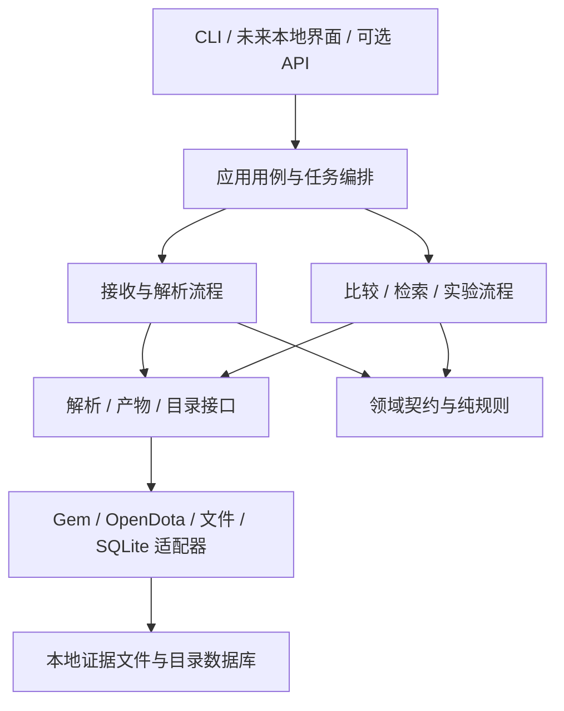

# 长期技术路线与架构决策

设计日期：2026-09-29。状态：**目标方案，尚未实现**。
当前实现见 [工程设计](engineering-design.md)，任务状态见 [roadmap](roadmap.md)。
目标是让个人项目能够逐步增加数据源、规则和分析能力，同时保留可验证的历史结果。

## 1. 产品路线与成功标准

| 层级 | 用户得到什么 | 进入条件 | 可以在此独立交付 |
|---|---|---|---|
| A 事实工具 | 一场比赛的装备记录、证据与质量状态 | 管道可靠、目标事件含义已核验 | 可用的购买日志浏览与排错工具 |
| B 比较工具 | 同条件参考分布、自己的位置、缺失与样本说明 | 已去重、范围元数据可信、分母清楚 | 单英雄复盘作品，首个主要目标 |
| C 案例工具 | 固定历史时刻的相似比赛及后续行为 | 截止规则和字段可用性可验证 | 可解释的相似案例系统 |
| D 研究平台 | 固定数据集上的基线与模型实验 | 标签、划分、评估与复现完整 | 研究报告或毕业项目扩展 |
| E 使用界面 | 本地导入、任务进度、浏览与核验 | A/B 稳定且命令行操作形成真实阻力 | 桌面浏览体验，不必等待模型 |
| F 多人服务 | 各自上传、异步解析、隔离报告 | 有持续多人需求和运维预算 | 可选，需单独设计服务边界 |

本项目的“教练”首先解释事实与差异，不承诺最优购买决策。模型预测行为，不自动取得指导资格。
如未来要研究装备的因果收益，应建立独立研究任务；当前观察性数据和评估不能证明该结论。

## 2. 架构原则

1. **本地优先、模块化单体。** 一个仓库、一个 Python 包、一个清晰的应用流程；CLI 与未来界面共用应用层。
2. **原始证据不可静默覆盖。** 变换产生新产物，保留来源、规则、版本和质量；人工修正用注释层表达。
3. **事实、推断、建议分层。** 购买事件是事实记录；角色估计和相似度是推断；解释不能把后两者伪装成前者。
4. **扩展由验收推动。** 数据不可用时降级；样本不够时缩小问题；需求不足时不引入新基础设施。
5. **有边界才抽象。** 解析器、存储和任务执行值得有接口；简单数值统计先用普通函数，不建立插件框架。

## 3. 目标分层与依赖方向

图中箭头表示调用路径；代码层面接口由应用/领域边界定义、适配器实现，领域层不导入 Gem、HTTP 客户端或 SQL。
CLI 负责参数与展示，不直接拼复杂 SQL 或统计规则；Notebook 只探索，稳定逻辑回到包内。

| 目标模块 | 责任与输出 | 不应承担 | 最早引入 |
|---|---|---|---|
| `domain` / `contracts` | 事件、质量、来源、版本化请求/结果 | 文件读写、HTTP、绘图 | M1 |
| `adapters/replay`、`adapters/opendota` | 将上游特有字段映射为约定，声明能力与限制 | 参考组筛选和决策解释 | M1，双源统一可后置 |
| `ingestion` | 校验输入、运行解析、安排标准化与提交 | 装备价值判断 | M1 |
| `storage` | 不可变产物、相对路径、目录事务、查询与恢复 | 修改事件语义 | M1 |
| `quality` | hash/引用验证、丢弃计数、质量门槛 | 把未知补成零或假设完整 | M1 |
| `metadata` | 补丁/英雄/物品快照、角色标注与冲突 | 用最新常量覆盖历史 | M2 |
| `datasets`、`cohorts` | 冻结样本清单、纳入排除、独立比赛计数 | 合并冲突来源或重复比赛 | M2/M3 |
| `analysis`、`reporting` | 统计与结构化结果；HTML 呈现 | 页面中偷偷补算业务规则 | M3 |
| `snapshots`、`retrieval` | 截止信息、特征版本、相似案例 | 使用未来字段或隐藏的玩家视角信息 | M4 |
| `experiments` | 数据划分、基线、评估、运行清单 | 改写冻结数据与测试集 | M5 |

这张表是逻辑职责，不要求一次创建所有目录。先在现有模块提取有测试保护的边界，避免为了架构改名而大搬迁。

## 4. 两条主流程

**写入流程：** 发现来源 → 校验/解包 → 内容识别与缓存判断 → 解析原始结果 → 标准化 →
证据与质量检查 → 发布不可变产物 → 目录提交 → 可选进入数据集。

**分析流程：** 选择已提交事实集 → 读取范围与静态资料版本 → 冻结参考样本 → 执行比较/快照/检索 →
形成带证据的结构化结果 → 渲染报告。报告版本与解析运行版本独立。

同一 raw JSON 可用新适配规则重新标准化；同一事实集可用新候选配置重新报告，尽量避免无意义地重解析 Demo。
初期可以在一个任务里串行完成，但记录解析与标准化两个阶段的指纹，后续才拆出独立重算入口。

## 5. 解析器与数据源的长期策略

Gem 继续作为首个本地解析适配器，固定已验证版本；升级采用固定回放集对照。
上游说明不完整回放可能返回部分结果，因此“解析函数返回”不能作为本项目的完整性门槛。
参见 [Gem 的能力与边界](https://github.com/whanyu1212/gem-dota#performance-and-scope)。

每个适配器声明能力清单：购买事件、游戏时钟、结束状态、经济、库存、可见性等分别为
supported / partial / unsupported / unverified，附已验证版本范围。声明要有测试或核验记录，不能照抄上游宣传。

上游变更处理顺序：保留失败原件 → 隔离受影响补丁 → 最小复现 → 升级适配器并对照 → 回填新运行。
仅当 Gem 在目标回放上持续不满足需求，再评估第二个解析器；共享领域契约，不让分析层依赖第二套原始格式。
OpenDota 主要用于可得数据与交叉核验，不作为“绝对真值”；两源不一致时显示冲突并选定研究来源。

本地输入是首选。未来自动下载应成为独立能力：提供已授权来源、下载状态、有限重试、校验和缓存，
下载不可用不阻止本地导入。远端解析申请可能有配额与费用，单独设计显式选项，不由报告生成隐式触发。

## 6. 技术选择与升级触发条件

| 领域 | 近期选择 | 何时重新评估 | 未来方向 |
|---|---|---|---|
| 包与依赖 | 保留 Python、Pydantic、httpx、pytest/Ruff；Gem 可选 | 环境难复现或升级频繁回归 | 锁定测试环境；研究依赖单独可选安装 |
| 元数据与事件 | 本地文件 + SQLite，串行写入 | 明确的跨主机并发写入、权限或运维需求 | PostgreSQL 目录；产物放对象存储 |
| 批量分析 | 先查询已规范化事件，不重复加载全量 raw | 基准显示扫描/内存已影响迭代 | 导出版本化 Parquet，用 DuckDB 查询 |
| 任务执行 | 一个受控子进程解析、单协调者提交 | 积压无法在可接受时间完成且机器有余量 | 有界本地 worker；再按多机需求引入队列 |
| 报告 | 结构化 JSON + 自包含 HTML | 用户需要筛选和反复浏览 | 本地薄界面，复杂交互再选择 Web 前端 |
| API | 暂无网络 API；应用服务边界稳定 | 真正的远程/多人访问 | HTTP 异步任务 API，与 worker 分离 |
| 检索 | 条件过滤 + 数值距离 | 基准显示传统距离不够且有评估数据 | 学习型表示；不因“AI”先上向量数据库 |
| 模型 | 简单频率/规则，再到 sklearn 基线 | 基线已严格评估且改进可复现 | 逐项增加模型复杂度 |

SQLite WAL 允许读写并行但仍只有一个写入者，且不适用于跨主机网络文件系统；
未来增加本地并发时仍由单协调者提交，不能把数据库放到共享盘作为多机服务方案。
参见 [SQLite WAL 官方说明](https://www.sqlite.org/wal.html)。

DuckDB 能直接查询 Parquet，因此可作为冻结数据集的分析出口，无需立即取代目录数据库。
这是后续选项，当前未实现该通路。参见 [DuckDB Parquet 文档](https://duckdb.org/docs/data/parquet)。

## 7. 本地界面与服务化边界

本地界面按使用流程组织：导入 → 查看进度/失败 → 选择玩家 → 确认范围 → 生成报告 → 查看证据。
质量未知时显示可操作原因；将 hash、字段路径等技术细节放在可展开的证据区。
UI 不自动改选补丁、填补角色或调整样本门槛来制造结果。

CLI 与 UI 使用同一套应用请求，长任务返回 task ID；进度由实际阶段和计数构成，未估计过的解析耗时不显示虚假百分比。
取消发生在安全边界，或终止解析子进程；不删除既有 committed 结果。

未来多人版本只在需要时增加：上传限制与校验、身份/任务归属、每用户配额、文件与报告访问隔离、
任务重试/取消、worker 资源限制、访问日志、清理策略及备份。
本地路径不暴露给远程客户端；上传内容按不可信输入处理；不要在 Web 请求进程内同步解析整场比赛。
服务化不会自动改变研究可信度，必须继续执行相同数据质量门槛。

## 8. 可选解释层与能力扩展

先用模板生成解释。未来若引入语言模型，仅让它解释已计算的结构化结果与检索案例，
输出关联 evidence ID；数字、样本和装备事件必须来自工具结果，不能凭语言模型补造。
未知状态保留，模板可回退。模型版本、提示词版本和费用要记录，进入计划前先做事实一致性评测。

扩展顺序建议为：更多已核验装备 → 更多英雄/位置 → 更多补丁 → 更细的局势条件。
每扩展一个维度都重看日志语义、样本稀疏和评估覆盖，不把“支持所有 hero_id”当成“已验证所有英雄”。
库存重建、合成链和实际使用时机应独立立项，并与 purchase_record 并存，不替换旧标签含义。

## 9. 架构决策记录

以下为本次选定的设计方向，具体实现尚未交付；条件变化时增加决策版本，保留取舍依据。

| ID | 决策 | 代价 | 重新评估条件 |
|---|---|---|---|
| ADR-01 | 模块化单体、本地优先 | 无即时多人协作 | 稳定用户需求和服务预算出现 |
| ADR-02 | 原始证据 + 不可变派生产物 + 小目录数据库 | 增加磁盘与产物管理工作 | 储存成本超过收益时采用有引用检查的保留策略 |
| ADR-03 | 事实记录先于库存/推荐 | 初期结论较保守 | 新事件语义有独立核验 |
| ADR-04 | Gem 作为可替换适配器 | 仍依赖上游解析质量 | 固定回放集持续不兼容或资源不能满足 |
| ADR-05 | 版本与来源作为数据的一部分 | 契约字段变多 | 不取消，只通过工具降低使用负担 |
| ADR-06 | 描述统计先于预测，模板先于生成式解释 | 产品早期不强调模型复杂度 | 有可复现收益和事实一致性证据 |
| ADR-07 | SQLite 负责目录，Parquet 仅在瓶颈后引入 | 初期分析吞吐有限 | 基准显示值得增加第二存储形式 |

## 10. 时间、资源与风险规划

按每周约 8～12 小时做学习计划的**示意预算**：M1 2～4 周，M2 1～2 周，M3 2～3 周；
M4/M5 各约 2～4 周且可选。它们不是承诺；解析兼容问题和样本获取可能成为主要耗时。
单次迭代以一个可验收任务为单位，同时进行的主要任务最多两个。

先对 1/10/100 场做代表性基准，记录硬件、Demo 大小、时长、解析版本、总耗时、峰值内存、
JSON/数据库体积和失败分布，再设时间与磁盘预算。扩到 1000 场前必须通过资源限制、恢复和去重验收。
目前没有足够数据承诺每场耗时、内存上限或大样本吞吐。

容量按“平均每场原件 + 原始解析 + 标准化 + 数据集/报告”的实测体积乘样本量估算，
加上 staging 与备份余量；升级新规则期间旧新运行会同时存在。仅导出研究所需列，避免让全量 raw 进入每次训练。

主要风险及退出条件：目标日志语义不稳定时缩小装备范围；补丁缺失时暂停同补丁比较；
样本稀疏时停止继续细分；模型无增益时交付基线与误差研究；无多人需求时维持本地工具。
这些都允许项目取得完整成果，无需不断扩张范围才能“完成”。
