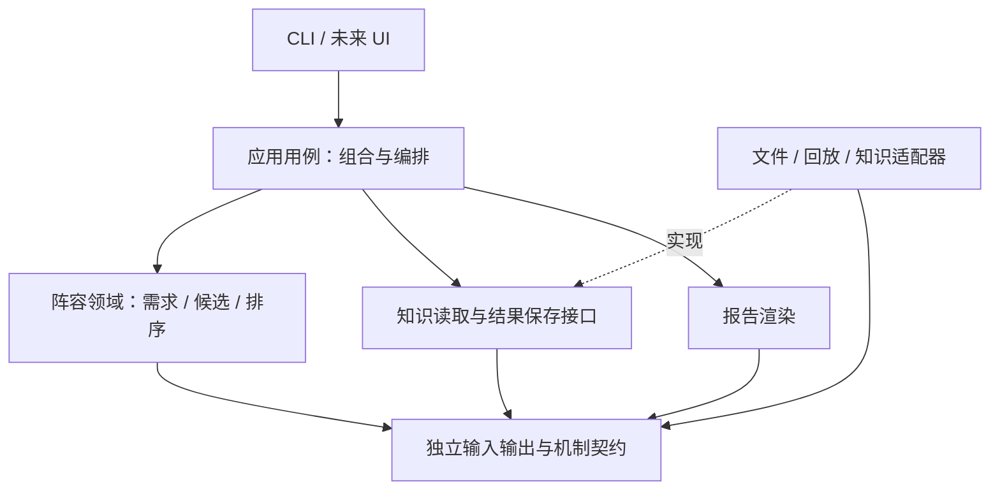

# 模块边界、耦合约束与扩展设计

更新：2026-10-10；实现审查基线 `c6a5e1f`。当前模块见 [工程设计](engineering-design.md)；本页明确**现状问题与目标约束**，不表示已完成重构。主线见 [开发流程](development-mainline.md)。采用模块化单体，不为目录数量或形式拆成微服务。

## 1. 当前耦合情况（静态核对）

下表是按职责、导入方向和变化传播面的定性判断，不是量化性能分数。包括函数内延迟导入；包级双向关系不等于已经触发 Python 循环导入错误。

| 模块 | 当前依赖/责任 | 耦合判断与风险 | 渐进处理 |
|---|---|---|---|
| `domain/normalize/analysis/report`（根目录文件） | 事实模型、规范化、购买分析、HTML | 内部较低；事实报告不能承载新推荐规则 | 维持旧入口；新推荐报告消费新结果对象 |
| `storage.py` | 哈希、路径、读写、锁 | 业务依赖低、被广泛使用；改变序列化会影响多数产物身份 | 保持底层无业务反向依赖，版本变更专门验收 |
| `sources/gem_replay.py` | 解压、Gem、规范化、SQLite 缓存与发布 | 较高：解析器升级影响来源/缓存/格式 | 先封装接入边界；后续按 D03/D12 拆解析与缓存，保留 facade |
| `data/cleaning.py`、`context.py` | 使用 `sources.gem_observations.number` | 数据规则反向依赖来源工具，语义看似通用实则绑定目录 | 将通用数值验证移到无 I/O 底层，保持等价回归；不是本轮代码变更 |
| `data/features.py`、`preprocessing.py` | 数据契约、pandas/sklearn | 相对集中；购买标签与特征同文件，但不等于推荐决策 | 新阵容任务用独立契约，不往旧 X 硬塞字段 |
| `data/pipeline.py` | Gem、storage、workflow.validation、Workspace 对象 | 较高：领域变换与流程/持久化混合 | 新应用层负责编排；纯分析不调用 pipeline |
| `workflow/validation.py`、`admission.py` | data.context、data.contracts、来源校验与 Gem 别名目录 | `data ↔ workflow` 包级双向关系 | 抽取中立契约/验证边界时保留兼容导入，不一次重写旧格式 |
| `workflow/workspace.py` | 导入、catalog、快照检查、doctor；延迟导入 pipeline | 枢纽较高，数据访问与用例混合 | 新推荐只通过显式读取适配器获得输入，不接收整个 Workspace |
| `workflow/jobs.py`、`reviews.py` | 运行、登记、预测校验与渲染 | 中高；新推荐若复用旧 Predictions 会绑定 item/route 和时刻引用 | 报告层适配，不强行复用不匹配契约 |
| `workflow/cli.py` | 组合各模块并调度 | 入口扇出大是预期；新增业务分支继续堆积有风险 | CLI 只校验参数、调用用例、输出及退出码 |
| `knowledge/hero-capabilities/` | 来源构建、档案、选人证据、候选导出 | 与正式包隔离，但版本未核验且未提供正式知识接口 | 通过验证后的知识包接入，禁止 src import 这些脚本 |
| `learning/` | 读取任务 Markdown、catalog 和源码路径 | 文档结构也是生成器接口；文字重排可影响消费者 | 重建并测试；不让正式包依赖学习目录 |

证据入口：[pipeline](../src/dota_items/data/pipeline.py)、[workspace](../src/dota_items/workflow/workspace.py)、[validation](../src/dota_items/workflow/validation.py)、[Gem](../src/dota_items/sources/gem_replay.py)、[学习生成器](../learning/build.py)。本轮不声称已经消除这些耦合。

## 2. 目标依赖方向（新主线）

以下均为**建议模块**，路径暂定、尚不存在；按纵向切片需要创建，不预建空包。

箭头表示代码依赖，不是数据流。应用用例依赖接口，入口组装具体适配器并注入；领域层只接收已加载、已验证的值对象，不访问磁盘、网络、CLI、Gem、Workspace 或模型训练框架。

| 建议位置 | 单一职责 | 允许依赖 | 禁止依赖 |
|---|---|---|---|
| `recommendation/contracts.py` | 阵容、知识条目、需求、候选、推荐结果 | 标准库、Pydantic | I/O、workflow、Gem、训练框架 |
| `recommendation/needs.py` | 机制与职责 → 需求 | 契约、纯规则 | 文件路径、raw、HTML |
| `recommendation/candidates.py` | 英雄适配、硬约束、候选生成 | 契约、已验证机制 | 网络、工作区 |
| `recommendation/ranking.py` | 软评分与确定性排序 | 契约、版本化策略 | 文本生成、下载、训练执行 |
| `application/recommend.py` | 调用顺序、降级、结果身份 | 领域与接口 | 参数解析器内部、页面状态 |
| `application/ports.py` | 知识获取/结果保存的最小接口 | 契约、typing.Protocol | 具体文件实现 |
| `adapters/knowledge_files.py` | 加载、校验知识文件与版本 | 接口、契约、storage | CLI、领域排序实现 |
| `adapters/match_lineup.py` | 已有比赛数据 → 阵容 DTO | 契约、现有读取接口 | 推导未观测的经济/位置 |
| 推荐报告渲染模块 | 结果 DTO → JSON/HTML/文本 | 契约、模板 | 重新计算分数或补造事实 |

不强制把每个函数包一层接口；只在 I/O 或明确需替换的排序策略边界抽象。通用层不做“万能 utils”，领域概念不混入 storage。

## 3. 规划契约（不是当前 CLI/Schema）

这些是 M01 的设计起点，需要实现和验收后才能成为公开接口；不要直接传入现有 `coach-predictions/1`。

| 对象 | 必要字段与语义 |
|---|---|
| LineupRequest | schema_version、patch=7.41f、双方各5个唯一 hero_id、目标阵营/英雄、role；10人全局不重复，目标属于阵容；命石不在契约内 |
| MechanicFact | fact_id、hero/ability/item 身份、效果与作用对象、条件/例外、source_ref/hash、source_patch、target_patch、review_status；来源版本未知不能直接 verified |
| Need | need_id、目标、需求类型、触发事实与规则、条件、已有队友能力、未知项；需求不等于必须由目标购买 |
| Candidate | item_id、满足需求、英雄/位置适配、阶段、硬约束结果、机会成本、规则与证据；过滤理由可检查 |
| Recommendation | schema/patch/knowledge/rules/engine 身份、输入指纹、supported/partial/unsupported、常规/针对/备选、分数分解、条件与局限 |

规则分数不是概率、胜率或因果收益，不为适配旧 [0,1] 分数契约伪装校准。无合格候选允许返回空列表和原因；非法输入/错误版本不能返回“成功但空”。当前未来实战输入不偷偷塞进 LineupRequest，另立兼容的新契约。

知识状态与训练准入分开：7.41f 机制核验通过，只允许对应规则引用，不解除旧真实训练 held。未知操作符、冲突事实、不可读取的证据必须可诊断，不能作为 false 或零分继续计算。

## 4. 扩展点与变化影响

| 新需求 | 预期修改面 | 不应需要修改 |
|---|---|---|
| 新英雄/装备，沿用现有机制 | 知识包、范围配置、案例 | CLI、存储、核心排序流程 |
| 新机制交互 | 机制契约/操作符、规则及边界案例 | 回放缓存、训练任务调度 |
| 新版本 | 新知识/规则包、兼容与回归结果 | 覆盖旧来源或批量改旧 manifest 的 patch |
| 文件输入换回放/API | 输入适配器 | 需求与排序逻辑 |
| 规则排序换学习排序 | 排序实现、模型加载适配器、评估 | 需求契约、报告字段含义；如变更则升级 schema |
| CLI 换网页 | 表现层和入口组装 | 复制一套领域规则 |
| 推荐十人和团队分工 | 新团队协调用例，显式联合约束 | 改写每个英雄的单人基础事实 |

新增依赖的方向在 PR 中列出。架构自动检查可在新增模块时使用现成 import-linter 或 AST 检查，先评估收益再接入；本轮不新增依赖，也未实现依赖门禁。

## 5. 分阶段解耦与兼容

1. M01–M05 优先把新领域逻辑保持纯净，旧链路通过窄适配器复用，不为推荐版重写 Gem/缓存。
2. 碰到通用 number 校验、证据引用或契约复用时，再抽取真正无来源依赖的模块；针对现有行为跑回归，保留旧 import facade。
3. D12 后续将 pipeline 编排与变换拆开，Workspace 保留兼容入口；D03/D04 分别处理缓存与发布恢复，避免把它们混成一个大重构。
4. 旧 `coach-features/1`、快照、准入记录继续按旧含义读取；新推荐/学习任务单独版本化，不扩大旧准入范围。

## 6. 架构验收要求

- 新推荐领域不能导入 sources/workflow/learning，也不能依赖 knowledge 脚本目录；网络断开、Gem 未安装仍能在合格知识包上运行。
- 固定知识、规则、输入下，输出排序确定；队内英雄输入顺序改变不应影响结果。并列排序明确稳定键。
- 改变一个敌方威胁只影响相关需求/候选；这些用例验证机制，不镜像实现公式。
- 错误版本、重复英雄、未知位置、证据损坏、未核验机制、条件不满足均有负例；缺口不能默认为不存在。
- 规则事实测试、集成契约测试、独立推荐质量评估分开报告。质量指标包括机制错误、引用支持、条件保留、范围覆盖、人工合理性及相对朴素基线结果；门槛在评估前冻结，不编造数值达标。
- 记录新增依赖边、循环依赖、改动模块面和检查结果；不给尚未实施的架构画“低耦合已完成”结论。
