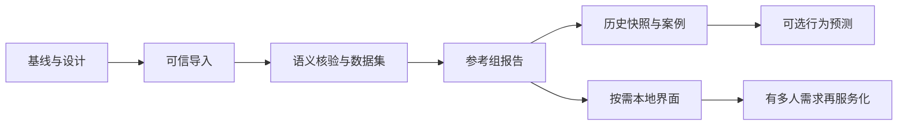

# 开发 TODO 与阶段验收

更新：2026-09-29。当前软件版本 v0.2.0。本次仅更新设计与计划，未实现下面的待办。
阶段名 M0～M7 表示里程碑，不承诺对应发布版本或固定完成日期；M6/M7 是按需分支。
`[x]` 只表示有对应产物/验证；下面未勾选的命令、字段和模块都尚未实现。

推荐主线：**可信管道 → 真实语义核验 → 参考组 MVP → 可选检索 → 可选模型**。
个人项目每次只推进一个可演示的纵向任务，不同时开前端、数据服务和训练框架。
问题证据见 [project-review](project-review.md)，命令和核验表见 [workflow](workflow.md)。
长期模块与技术决策见 [技术路线](long-term-roadmap.md)，字段/状态权威定义见
[数据契约](data-contracts.md)，测试与发布标准见 [交付规范](validation-and-delivery.md)。

图是产品演进顺序；模型只依赖可靠快照和评估，不必先完成案例检索功能。

## M0：已有基线与文档对齐

- [x] Python 包、CLI、OpenDota 抓取缓存、单玩家标准化与首次记录分析。
- [x] 本地 Demo/压缩包 → Gem JSON → 标准 JSON → SQLite；串行目录批处理。
- [x] HTML/JSON 报告、合成测试与 GitHub Actions。
- [x] 一场公开回放 8822520406：10 玩家、362 事件，原始引用可追溯。
- [x] 2026-09-28 复跑现有检查：25 tests passed，Ruff 检查与格式检查通过。
- [x] 重写主设计、审查记录、运行核验流程与 TODO；旧文档入口转向新设计。
- [x] 2026-09-29 补齐长期架构、数据/接口契约、迁移策略、测试/实验/交付规范与文档导航。

边界：尚未完成用户自己比赛的游戏画面核验；单场成功不代表真实语义和各补丁兼容性验收通过。

## M1：数据可信性（先做）

| ID / 优先级 | 待办与交付物 | 依赖 | 完成验收 |
|---|---|---|---|
| D01 / P1 | 修正 Gem 测试替身；加入原始 JSON 结构 fixture、证据校验器与负例；设计 `data-validate` 入口 | 无 | 每条 source_ref 可解析且 key/time/tick 对齐；删改 raw、错误 hash、越界引用均被检出；没有 raw 时明确“未验证”，不能冒充验证通过 |
| D02 / P1 | 分离输入来源、回放内容、比赛和解析运行；区分逻辑比赛数与来源文件数 | 无 | 同一 Demo 的 dem/bz2/zst/zip 只计一场及一套事件，同时保留四个来源；同 match_id 不同内容标为修订/冲突，不静默丢弃 |
| D03 / P1 | 版本化 manifest 与缓存策略；区分解析/标准化推导键和执行 attempt；保存输出 hash 与依赖版本 | D01、D02 | 缺 manifest、改输出内容或版本变化时不能返回健康缓存；只改标准化规则可复用 raw；重跑可追溯；按数据契约设计旧库迁移 |
| D04 / P1 | staging、不可变运行目录、committed 指针、失败记录与恢复；写入互斥 | D02、D03 | 分别在 raw 写完、normalized 写完、DB 提交前注入失败，旧运行仍可用；重试可恢复；并发写入不会混合产物 |
| D05 / P1 | 结构化质量摘要、事件计数与完整性状态；执行状态与研究资格分开 | D01、D04 | 保留/预期过滤/异常丢弃/未知计数可核对；截断/缺结束标志/缺英雄不默认为完整；committed + quarantined 可浏览但不入研究集 |

- [ ] D01 完成并附正反例校验结果。
- [ ] D02 完成并附四种封装去重结果。
- [ ] D03 完成并附过期缓存、内容篡改与迁移验证。
- [ ] D04 完成并附故障注入和重跑记录。
- [ ] D05 完成并附完整/不完整/未知质量样例。

**M1 出口：** 单场结果可验证，重复导入不扩大逻辑样本，失败重跑不破坏已提交数据。
未通过前可继续单场调试和人工核验，但不批量扩库或发布参考组统计。
下一次最小开发任务建议为 D01：它能暴露当前测试没有覆盖的证据链问题。

## M1 后续：进入稳定批处理前

- [ ] **D06 / P2 可搬迁与平台检查**（依赖 D02～D04）：索引存相对路径；旧绝对路径迁移有备份；
  搬迁 data 后查询、校验、缓存、报告均正常；增加 Windows 基础管道 CI。
- [ ] **D07 / P2 资源与任务状态**（可并行设计）：原生和解压后 Demo 使用相同大小限制；
  记录耗时、输入/输出体积、状态和失败摘要；子进程超时/取消在批处理前验收；单个坏文件不拖住其余文件。
- [ ] **D08 / P2 双来源协议**（依赖 D01～D05）：OpenDota 缓存同样验证内容，版本与来源进入共同目录/索引协议；
  同场两源保留独立证据，禁止事件相加；不要求在首个本地 Demo 参考组前完成。
- [ ] **D09 / P2 环境复现**（V03 前）：保存支持平台的依赖锁定或明确的安装快照；
  干净环境可装并跑通；实验保存 Python/依赖/代码版本；定期检查 CI Actions 运行时更新。
- [ ] **D10 / P2 真实解析能力矩阵**（依赖 D01、D05，M2 前）：建立允许使用的固定回放集；
  记录 parser/adapter/补丁/平台/能力覆盖，升级时产出语义差异；未测能力明确为 unverified。
- [ ] **D11 / P2 迁移与备份恢复**（依赖 D03、D06，V03 前）：按新旧并存方式迁移 v0.2 数据；
  旧新映射可查，从备份恢复到新路径后数量/证据/报告一致；清理能列出引用影响，不自动删旧证据。
- [ ] **D12 / P2 应用边界整理**（依赖 M1，M6 前）：从现有混合模块提取解析、存储、应用用例；
  CLI 调用同一接口，领域不依赖 Gem/SQL/HTTP；维持现有行为和有版本的机器输出，不一次创建全部未来模块。

## M2：选范围、核验真实标签、冻结小数据集

- [ ] **V01 范围与元数据**：按 [核验记录模板](workflow.md#5-可复制的人工核验记录) 选一个英雄/位置/模式/补丁及 3～5 件装备。
  保存 patch 与角色的来源、known/unknown/conflict 状态；手工确认可作为起点；未知不自动入组。
- [ ] **V02 双向人工核验**（依赖 V01、D01；可与 M1 后续并行）：收集自己的 3～5 场，
  初查 10～20 个事件，覆盖赛前、重复购买、配方、自动合成、暂停、送达差异；
  再独立标注目标装备或明确窗口中的全部目标事件，统计漏检；未出现的边界保留未覆盖状态。
- [ ] **V03 质量报告与冻结清单**（依赖 M1、V02、D09、D11）：记录匹配数、误检/漏检、时间误差、
  缺失与丢弃原因、纳入/排除比赛；保存选定 run ID、输入/输出 hash、范围配置与代码/依赖版本。
- [ ] **V04 继续/缩小范围决定**：任何系统性错位或目标装备语义歧义必须修复或排除；
  语义无法确认时只保留购买日志浏览功能，形成一页结论和未解决清单。

**M2 出口：** 用户能从报告回到回放核实事件，清楚哪些标签可信、哪些未知。
“核对了 20 条”本身不是通过条件；必须写出错误、覆盖范围和处理结论。

## M3：第一个有比较价值的版本

- [ ] **C01 样本纳入与去重**（依赖 M1、M2）：同英雄、确认位置、补丁、模式；
  每个 match_id 选一个合格运行，排除待分析比赛；按来源/过滤规则分组；输出排除原因。
- [ ] **C02 描述统计**（依赖 C01）：展示独立比赛数、日志可用数、装备有记录数、无记录数、
  缺失/异常数和观察窗口；仅在有记录者中计算首次时间的中位数与四分位数。
- [ ] **C03 样本不足降级**：显示阈值可配置，30 场只是工程起点；空组/少样本/未知补丁时
  明确降级，不自动混补丁；固定窗口比较单列观察不足的比赛。
- [ ] **C04 可解释报告**：加入个人位置与参考分布、样本组成、配置/数据集指纹及引用比赛；
  用构造数据验证统计数值，人工复核 3 个不同质量场景，不输出“应该几点买”。

**M3 出口：** 对一场自己的比赛，能解释“和谁比较、多少场、哪些数据缺失、首次记录在哪个范围”。
这是第一份适合项目展示的完整成果，可以在此收尾；模型不是必需交付。

## M4：经济条件与历史案例（按兴趣继续）

- [ ] **E01 字段契约**：核验累计收入/未花费金币/净资产、经验与时间单位；
  明确采样时刻和截止可用性；静态物品/英雄资料绑定版本快照。
- [ ] **E02 快照与角色来源**（依赖 E01）：仅使用 cutoff 及之前的数据，区分赛后全知和玩家可知视角；
  没有可靠敌方可见性或库存则排除该类特征。
- [ ] **E03 最近邻基线**（依赖 E02、C01）：类别过滤 + 训练集尺度下的数值距离；
  返回相似性、差异和随后路线；排除自身比赛与非历史样本。
- [ ] **E04 评估**：按比赛/时间划分，预处理和学习型距离只在训练集拟合，方案与阈值在验证集选择；
  截止测试能抓住未来字段与未来角色推断泄漏，保存人工复核的错误案例。

## M5：行为预测实验（可选）

- [ ] **ML01 固定任务**（依赖 E01、E02、E04，不强制 E03）：在下一装备分类、未来 5 分钟首次记录、含截尾时间模型中只选一个；
  定义已购装备排除、其他/无事件类别、观察窗口和截尾处理。
- [ ] **ML02 公平基线**：同样数据划分下比较频率、规则、Logistic Regression、树模型；
  标准化和缺失填补只在训练集拟合。
- [ ] **ML03 评估与复现**：按比赛分组，保留更晚测试集；报告相对基线的提升、校准、
  缺失子组表现与按比赛计算的不确定性；保存配置、数据快照和误判案例。
- [ ] **ML04 研究结论**：解释提升或无提升，说明样本偏差与适用范围；
  明确预测的是购买行为，不是装备对胜负的因果价值。

## M6：本地使用体验（M3 后可独立推进）

- [ ] **U01 / P3**：报告页眉版本从包元数据读取；缺失版本用“未知”；质量提示分层显示。
- [ ] **U02 / P3 使用流程**（依赖 M3）：记录自己和少量试用者在导入、选玩家、理解报告时的具体障碍；
  按反馈选择最小本地界面方案；无明显障碍时继续维护 CLI/HTML 即可。
- [ ] **U03 / P3 界面与任务状态**（依赖 U02、D07、D12）：本地导入/进度/失败/取消/报告浏览共用应用接口；
  刷新不会重复提交比赛，不在页面请求中阻塞解析；CLI 与界面结果一致。
- [ ] **U04 / P3 解释与证据**（依赖 U03）：技术细节可展开，未知/小样本有明确说明，证据可定位；
  复核三种质量状态，不让“成功”按钮掩盖 quarantined 状态。

## M7：服务化与进一步研究（达到触发条件才启动）

- [ ] **S01 服务化立项门槛**：确认持续多人需求、数据处理授权范围、预计负载与费用预算，
  写出独立服务设计；没有需求时维持本地版本，不因路线图存在而自动开工。
- [ ] **S02 异步 API 与隔离**（依赖 S01、D12、M6）：API 只接收任务与查询状态，worker 解析；
  验收任务归属、资源限额、取消/重试、上传路径隔离、报告访问权限与隐私删除。
- [ ] **S03 服务存储与运维**（依赖 S01）：用实测决定是否迁移 PostgreSQL/对象存储及引入队列；
  明确幂等、备份恢复、费用/磁盘上限；禁止用网络共享 SQLite 代替服务数据库。
- [ ] **X01 多英雄/多版本扩展**（依赖 M3）：按范围逐项添加质量与兼容证据；新范围单独评估，
  不把通过类型检查等同于支持其游戏语义。
- [ ] **X02 库存与装备实际可用时机**（独立研究）：先定义来源、合成/拆分/背包/信使状态与标注方法；
  与 purchase_record 并存，达不到可靠重建条件时不对外宣称可用时间。
- [ ] **X03 可选语言模型解释**（依赖稳定比较/案例结果）：先写事实一致性和证据引用评测，
  模型只解释结构化结果；无可靠收益时保留模板，不让它生成统计数值或最优出装结论。

## 迭代、发布与完成定义

日常从待办中选一个可验收任务，记录开始条件、交付物、风险与回退；不把整个阶段当作一次大提交。
每个里程碑留一份演示、验收记录和已知局限。工期估算见技术路线，仅作为兼职学习预算。

每项任务关闭前应附：改动位置、正反例验收结果、数据/schema 兼容说明、文档同步。
代码检查通过后只对相关风险追加验证，不以增加测试数量代替真实标签质量。
